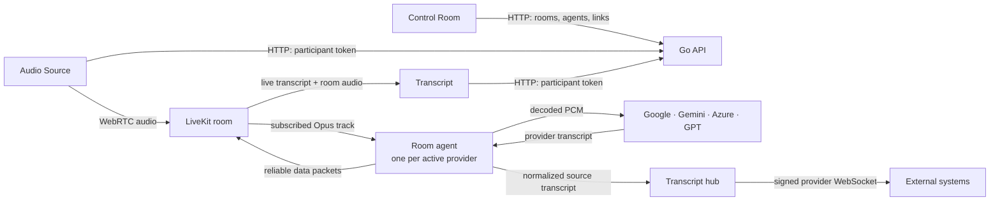
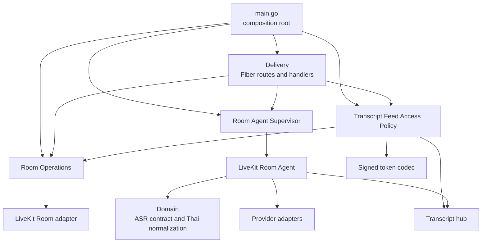

# CaptionLive

<p>
  
</p>

CaptionLive is a real-time transcription workspace built on LiveKit. It sends microphone or browser-tab audio over WebRTC, transcribes it through one or more provider agents, and delivers live Draft and final text to the in-app Transcript view or signed external WebSocket feeds.

The system is designed for operators who need explicit room, audio, provider, and output state—not a meeting bot or a browser-to-provider proxy.

## What the system provides

- Microphone and Chrome Tab audio publishing through LiveKit.
- Independent Google, Gemini, Azure, and GPT Realtime Whisper provider agents.
- Replaceable interim Draft text and committed final transcript rows.
- Read-only live Transcript view with provider filtering and final-only text export.
- Live or moderated publishing per room/provider, with a keyboard-first Caption Desk for human review.
- Separate signed WebSocket feeds for raw provider output and approved plain-text captions.
- Room, participant, provider, and link management from one Control Room.

## Product surfaces

| Surface | Route | Responsibility |
| --- | --- | --- |
| **Control Room** | `#admin` or `/` | Create rooms, share links, run providers, monitor participants, and generate external feeds |
| **Audio Source** | `#stream?room=<room>` | Select microphone or Chrome Tab audio and publish it to the room |
| **Transcript** | `#viewer?room=<room>&autoconnect=1` | Subscribe to room audio and follow live transcript output without publishing |
| **Caption Desk** | `#caption-desk?room=<room>&provider=<provider>` | Review final text—or opt into interim review—and publish approved captions with Enter |

The normal operating sequence is:

1. Create or select a room in **Control Room**.
2. Open **Audio Source** and connect microphone or Chrome Tab audio.
3. Start one or more transcription providers.
4. Follow output in **Transcript**, export finalized text, or generate a signed external feed.

## System flow



### Control plane and media plane

CaptionLive separates control traffic from realtime media:

- **HTTP control plane:** tokens, rooms, participants, provider lifecycle, and signed transcript links.
- **LiveKit media plane:** browser audio, participant audio subscription, and transcript data packets.
- **External output plane:** read-only provider-specific WebSocket feeds from the backend transcript hub.

Audio never travels through the public backend WebSocket API. The browser publishes audio only to LiveKit, and ASR credentials remain in the Go backend.

## Transcript lifecycle

Each room/provider agent runs in one of two modes:

- `live`: existing interim and final transcript packets go directly to viewers.
- `moderated`: source Draft and final segments go only to the active Caption Desk operator. Final review queues every segment by default; Interim review is an explicit latest-only mode that clears the moderation backlog and lets the operator publish the current Draft before final. Viewers receive approved results on `caption.public`.

Caption Desk uses `Enter` to publish and `Shift+Enter` for a newline. It permits one in-flight publication per source segment; later segments may continue to queue. Publishing an interim consumes that provider segment, so its later final is suppressed from the moderation queue. Pending moderation state is bounded and held in agent memory; restarting the agent clears it.

Provider output stays identifiable and replaceable while it is still changing:

```text
Provider interim → replace active Draft
Provider final   → commit transcript row and clear Draft
```

The lean external WebSocket uses one JSON object per text frame:

```json
{"text":"ผู้ป่วยมีอาการ","isFinal":false}
{"text":"ผู้ป่วยมีอาการเจ็บหน้าอก","isFinal":false}
{"text":"ผู้ป่วยมีอาการเจ็บหน้าอก","isFinal":true}
```

Moderated agents additionally expose an approved-caption feed. It emits one plain UTF-8 text frame per approved publication:

```text
ผู้ป่วยมีอาการเจ็บหน้าอก
```

It emits no JSON, Drafts, ready event, replay, or client commands. Raw and approved tokens carry different signed feed purposes and cannot be used interchangeably.

Interim and final text originates from the selected ASR provider. CaptionLive routes provider results, accumulates provider deltas into full snapshots where required, and applies deterministic spacing normalization. Google Thai additionally removes provider-added spaces between Thai words; other providers retain the shared policy. CaptionLive does not invent interim wording.

Important output rules:

- Provider feeds are isolated by room and provider.
- A client replaces its active Draft when `isFinal` is `false`.
- A client appends committed output and clears the Draft when `isFinal` is `true`.
- External feeds are read-only and have no audio input, commands, history, or replay.
- Gemini translation stays on the LiveKit data channel for the bilingual in-app view; provider WebSocket feeds expose source transcript text.

See [backend-go/README.md](backend-go/README.md#http-api) for the complete HTTP and WebSocket contracts.

## Architecture

| Layer | Technology | Main responsibility |
| --- | --- | --- |
| Frontend | React 19, TypeScript, Vite, Tailwind CSS | Control Room, Audio Source, Transcript, LiveKit client state |
| Backend | Go 1.24, Fiber | Control API, tokens, room agents, transcript hub |
| Realtime | LiveKit | WebRTC audio transport; lossy Draft and reliable final transcript delivery |
| Audio | Opus + CGO | Decode browser audio and resample PCM for each provider |
| ASR | Google, Gemini, Azure, OpenAI | Interim/final transcription and provider-specific behavior |

### Backend at a glance

The Go backend is split into delivery, application policy, domain contracts, and infrastructure adapters. `main.go` is the composition root: it constructs the modules once and passes them to the Fiber routes.



The three application modules own the operational rules:

- **Room Operations** provisions and inspects rooms, applies LiveKit timeouts, preserves room identity, and distinguishes a missing room from an empty room.
- **Room Agent Supervisor** owns asynchronous room/provider agent start, stop, replacement protection, room deletion cleanup, and graceful shutdown.
- **Transcript Feed Access Policy** issues and authorizes read-only feed grants bound to room name, LiveKit Room SID, transcript generation, and optional provider.

Handlers only parse HTTP input and map module errors to status codes. LiveKit SDK, JWT signing, transcript fan-out, audio processing, and provider protocols stay behind infrastructure modules. See the [backend architecture guide](backend-go/README.md#architecture) for request and lifecycle flows.

### Repository structure

```text
.
├── frontend/                  # CaptionLive React application
│   ├── components/            # Control Room, Audio Source, Transcript, shared UI
│   ├── hooks/                 # LiveKit publisher/viewer and audio lifecycle
│   ├── lib/                   # Transcript state, routing, export, and API helpers
│   └── public/                # CaptionLive logo and favicon
├── backend-go/                # Fiber API and LiveKit room agents
│   ├── config/                # Environment-backed configuration
│   └── internal/
│       ├── application/       # Room operations, agent supervision, transcript access policy
│       ├── delivery/          # HTTP/WebSocket routes and handlers
│       ├── domain/            # Provider contracts and normalization
│       └── infrastructure/    # LiveKit adapters, room agent, transcript/JWT, ASR providers
├── livekit/                   # Local LiveKit Docker Compose environment
├── start.sh                  # Local frontend/backend launcher
└── AGENTS.md                 # Repository development rules
```

## Supported providers

| Provider | Main output |
| --- | --- |
| Google Cloud STT | Thai source transcript with interim and final results |
| Gemini Live | Source transcript plus configured-target translation in the in-app Lines view |
| Azure Speech | Source interim hypotheses and finalized phrases |
| GPT Realtime Whisper | Source-only Draft and final transcription |

Provider models, sample rates, endpointing, reconnect behavior, and credentials are documented in [backend-go/README.md](backend-go/README.md#provider-behavior).

## Prerequisites

- Node.js 18 or newer and `pnpm`.
- Go 1.24.4 or a compatible newer release.
- Docker with Docker Compose.
- A C compiler, `pkg-config`, and the system Opus development library.
- Credentials for at least one transcription provider.

```bash
# macOS
brew install opus pkg-config

# Debian/Ubuntu
sudo apt-get install -y build-essential pkg-config libopus-dev
```

## Getting started

### 1. Start LiveKit

```bash
cp livekit/.env.example livekit/.env
cd livekit
docker compose up -d
docker compose ps
cd ..
```

Local defaults use `devkey` / `secret`; replace them outside local development.

### 2. Configure the backend

```bash
cp backend-go/.env.example backend-go/.env
```

Set the LiveKit connection and credentials for at least one provider. To generate external transcript links, also set `TRANSCRIPT_WS_SECRET` to a secret of at least 32 random bytes.

### 3. Configure the frontend

```bash
cp frontend/.env.example frontend/.env
cd frontend
pnpm install
cd ..
```

### 4. Start CaptionLive

```bash
./start.sh
```

Open:

- Control Room: [http://localhost:5173](http://localhost:5173)
- Audio Source: [http://localhost:5173/#stream?room=test](http://localhost:5173/#stream?room=test)
- Transcript: [http://localhost:5173/#viewer?room=test&autoconnect=1](http://localhost:5173/#viewer?room=test&autoconnect=1)
- Backend health: [http://localhost:3000/health](http://localhost:3000/health)

LiveKit must already be running; `start.sh` starts only the frontend and backend.

## Essential configuration

| Variable | Where | Purpose |
| --- | --- | --- |
| `LIVEKIT_API_KEY` / `LIVEKIT_API_SECRET` | Backend and LiveKit | Server authentication |
| `LIVEKIT_WS_URL` | Backend | LiveKit connection used by room agents |
| `VITE_LIVEKIT_URL` | Frontend | LiveKit connection used by browsers |
| `VITE_BACKEND_URL` | Frontend | Go HTTP API base URL |
| `TRANSCRIPT_WS_SECRET` | Backend | Enables signed external transcript feeds |
| `CONTROL_API_KEY` | Backend and trusted frontend | Protects remote control-plane APIs |
| Provider credentials | Backend | Enables Google, Gemini, Azure, or OpenAI |

Never commit `.env` files, service-account JSON, API keys, or generated tokens. See the [backend configuration reference](backend-go/README.md#environment-variables) and [frontend configuration reference](frontend/README.md#environment).

## Development and verification

```bash
# Frontend
cd frontend
pnpm test
pnpm build

# Backend
cd backend-go
go test ./...
go test -race ./...
go build ./...
```

Use `go test -race ./...` after agent lifecycle, channel, mutex, or reconnect changes. The Go Opus dependency requires CGO and a discoverable system Opus library.

## Operational boundaries

- There are no public browser-to-ASR or browser-to-backend audio WebSocket endpoints.
- Audio Source and Transcript participant tokens are issued only for rooms already provisioned through Control Room. Opening an unknown room link shows an unavailable-room state and cannot create a room.
- Audio source changes are allowed only while the Audio Source is disconnected.
- Chrome Tab audio requires selecting a browser tab and enabling **Share tab audio**.
- A normal Audio Source disconnect releases its track-scoped provider while the room agent waits for the next track.
- Unexpected provider failure stops the affected room agent instead of reporting a false healthy state.
- Remote deployments require HTTPS/WSS, restricted origins, correct LiveKit external IP/UDP configuration, and TURN where necessary.
- `VITE_CONTROL_API_KEY` is suitable only for trusted internal deployments; do not embed it in a public frontend build.

## Documentation map

Start here, then move to the document that owns the detail:

| Document | Use it for |
| --- | --- |
| [Frontend guide](frontend/README.md) | Routes, browser requirements, transcript UI state, frontend environment |
| [Backend guide](backend-go/README.md) | Provider behavior, environment variables, HTTP/WebSocket contracts |
| [LiveKit local setup](livekit/README.md) | Containers, ports, verification, and production networking checklist |
| [LiveKit data flow](backend-go/docs/LIVEKIT_FLOW.md) | Detailed publisher, agent, viewer, and transcript packet flow |
| [Google gRPC flow](backend-go/docs/GOOGLE_GRPC_FLOW.md) | Google streaming implementation |
| [Azure WebSocket flow](backend-go/docs/AZURE_WEBSOCKET_FLOW.md) | Azure upstream provider protocol |
| [Google stream-limit handling](backend-go/docs/ISSUE_GOOGLE_5MIN_LIMIT.md) | Google reconnect and replay behavior |
| [VAD and endpointing](backend-go/docs/VAD_CONFIGURATION.md) | Silence boundaries and provider endpointing |
| [Product principles](PRODUCT.md) | Product and interface decisions |
| [Repository agent guide](AGENTS.md) | Development constraints and verification rules |

`backend-go/docs/EDITOR_MODE_DESIGN.md` is the earlier design proposal. Use the implemented flow documented above and in `backend-go/docs/LIVEKIT_FLOW.md` as the current contract.

## License

MIT
