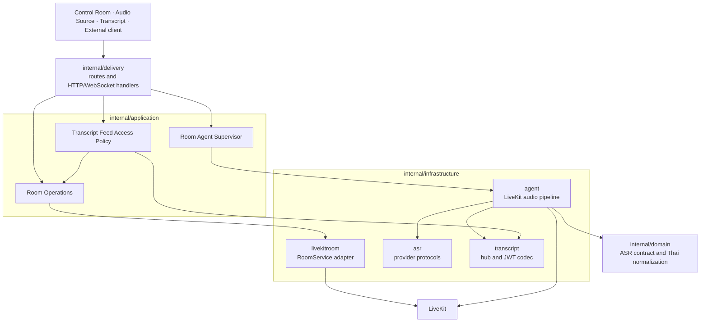

# Go backend and LiveKit agent

The Go service exposes HTTP endpoints for provider status, LiveKit tokens, room management, and room-agent lifecycle. Audio does not pass through Fiber: the agent subscribes to LiveKit audio tracks, decodes Opus, invokes one ASR provider, and publishes transcript JSON through the room data channel.

## Requirements

- Go 1.24.4+
- CGO enabled
- A C compiler, `pkg-config`, and Opus development library
- Reachable LiveKit server
- Credentials for Google, Gemini, Azure, or OpenAI Realtime Whisper

```bash
# macOS
brew install opus pkg-config

# Debian/Ubuntu
sudo apt-get install -y build-essential pkg-config libopus-dev
```

## Run locally

```bash
cp .env.example .env
go mod download
go run .
```

The service listens at `http://localhost:3000` by default. LiveKit must be running separately.

## Architecture

`main.go` is the composition root. It creates each long-lived module once, injects infrastructure adapters, and passes the completed modules to the delivery layer.



### Module responsibilities

| Module | Owns | Does not own |
| --- | --- | --- |
| `application/roomoperations` | Room lookup, creation, participant inspection, timeout policy, LiveKit error semantics | LiveKit SDK types or HTTP status codes |
| `application/agentsupervisor` | One agent per room/provider, asynchronous lifecycle, stale-instance protection, room cleanup, shutdown | Provider credentials or Fiber requests |
| `application/captionmoderation` | Bounded pending segments, ordered publish validation, idempotent requests, rollback | LiveKit or HTTP transport |
| `application/transcriptaccess` | Feed scope validation and grants bound to room, Room SID, generation, provider, and feed purpose | JWT implementation or WebSocket transport |
| `delivery` | Request parsing, control authentication, routes, response/error mapping, WebSocket upgrade | Agent state maps or access-policy decisions |
| `infrastructure/livekitroom` | Translation between LiveKit RoomService and Room Operations records/errors | Room policy |
| `infrastructure/agent` | LiveKit subscription, Opus decode, PCM routing, provider lifecycle, transcript publishing | HTTP lifecycle management |
| `infrastructure/transcript` | Signed JWT codec, room/provider subscribers, bounded fan-out, generation tracking | Route authorization policy |
| `infrastructure/asr` | Provider-specific streaming protocols, reconnect, interim/final parsing | Browser capture or HTTP endpoints |
| `domain` | Provider-independent ASR contract and Thai spacing normalization | SDK-specific protocol details |

Request/response DTOs live in `models`.

### Control request flow

```text
HTTP request
  → Fiber route and control authentication
  → delivery handler validates the request shape
  → application module applies operational policy
  → infrastructure adapter calls LiveKit or signs/verifies a token
  → handler maps the result to an HTTP response
```

Room behavior is explicit:

- Control Room creates rooms through `Room Operations`.
- Participant-token requests first verify the room exists; LiveKit cannot implicitly create a room from an unknown Audio Source or Transcript link.
- Room detail lookup verifies room identity before loading participants, so a missing room is not reported as an empty room.
- Deleting a room stops its supervised agents and invalidates active and previously generated transcript-feed grants.

### Audio and transcript flow

```text
Browser WebRTC audio
  → LiveKit room
  → supervised room/provider agent
  → Opus decode at 48 kHz mono
  → 40 ms PCM batching and provider-rate resampling
  → Google / Gemini / Azure / GPT Realtime Whisper
  → Thai spacing normalization at the agent output boundary
  ├── raw transcript data packet → Audio Source / Transcript UI
  └── optional targeted Caption Desk Draft/final queue → approved `caption.public`
      └── bounded caption hub → signed plain-text approved WebSocket
```

The backend never accepts browser audio through its public WebSocket endpoints.

### Transcript-feed authorization

The `Transcript Feed Access Policy` is the single module used by both token-generation handlers and WebSocket authorization middleware:

1. Validate the room and optional provider scope.
2. Confirm that the LiveKit room exists and read its Room SID.
3. Bind the grant to `transcript` or `caption` purpose.
4. Issue or verify it against the current transcript generation.
5. Reject a grant when its room, Room SID, provider, purpose, generation, signature, or expiry differs.

Provider-specific and room-wide WebSocket endpoints remain separate because their payload contracts differ, but they share the same authorization policy and token codec.

## Provider behavior

| Provider | Input from agent | Important behavior |
| --- | --- | --- |
| Google | 48 kHz Linear16 PCM | Speech-to-Text V2 streaming, interim enabled, automatic punctuation, pre-limit reconnect and one-second replay buffer |
| Gemini | 16 kHz PCM | Source plus configured-target transcription paired by application `turnId`; session resumption, context compression, and bounded connection reconnect; required model audio response is discarded |
| GPT Realtime Whisper | 24 kHz PCM16 | `/v1/realtime?intent=transcription`; source interim deltas and completed finals; 650 ms silence/30-second hard boundary; bounded reconnect with one-second audio replay |
| Azure | 16 kHz PCM/WAV stream | Azure upstream WebSocket conversation recognition with interim hypotheses and endpointing settings |

Google uses `chirp_2`, `th-TH`, and `asia-southeast1` by default. Gemini uses `gemini-3.5-live-translate-preview`, detects the source language unless a hint is configured, and translates to Thai by default. Gemini requests an application boundary after 650 ms of low-energy PCM or 30 seconds of continuous audio, then waits a fixed 500 ms for delayed translation. Its Live connection enables standard session resumption and sliding-window context compression, reconnects on `GoAway` or transport failure, and attempts a rotation after nine minutes only when the server has supplied a safe resumption handle. Reconnect uses three bounded backoff attempts, with the final attempt starting a fresh session if resumption fails, and replays up to fifteen seconds of PCM received during the handoff. If no safe handle is available, scheduled rotation is deferred; a server-side close falls back to a fresh session and finalizes the prior application turn first. GPT Realtime Whisper uses the dedicated Realtime transcription intent with `gpt-realtime-whisper` as the input transcription model, streams 24 kHz PCM16, commits after the shared 650 ms silence boundary or a 30-second hard duration, and publishes only source transcript text. Recoverable WebSocket failures use bounded exponential-backoff reconnects and replay up to one second of recent PCM; exhausting retries closes the result stream so the room agent becomes unhealthy instead of remaining falsely connected.

## Agent and audio-track lifecycle

- An agent is keyed by room and provider and remains subscribed after it joins the LiveKit room.
- Each incoming audio track creates a track-scoped ASR provider. A normal sender disconnect, unpublish, or end-of-track releases that provider while the agent stays in the room and waits for another track.
- A provider start failure or unexpected provider error stops the agent so `/livekit/agent/status` cannot report a falsely healthy transcriber.
- Explicit Admin stop remains the operation that disconnects the agent participant from the room.
- The current lifecycle is designed for one active Audio Sender per room/provider agent.

## Environment variables

| Variable | Default | Notes |
| --- | --- | --- |
| `HOST` | `localhost` | Fiber bind host |
| `PORT` | `3000` | Fiber HTTP port |
| `ALLOWED_ORIGINS` | Local origins | Comma-separated CORS allowlist |
| `LIVEKIT_API_KEY` | — | Required with secret for LiveKit routes |
| `LIVEKIT_API_SECRET` | — | Keep server-side only |
| `LIVEKIT_WS_URL` | `ws://localhost:7880` | LiveKit URL used by SDK clients |
| `TRANSCRIPT_WS_SECRET` | — | At least 32 random bytes; enables signed external transcript links |
| `CONTROL_API_KEY` | — | At least 32 random bytes; required for remote control-plane APIs |
| `GOOGLE_CLOUD_PROJECT` | — | Required for Google |
| `GOOGLE_APPLICATION_CREDENTIALS` | — | Service-account JSON path |
| `GOOGLE_API_KEY` | — | Alternative Google authentication |
| `GOOGLE_CLOUD_LOCATION` | `asia-southeast1` | Speech-to-Text V2 region |
| `GOOGLE_SPEECH_MODEL` | `chirp_2` | Recognition model |
| `GEMINI_API_KEY` | — | Required for Gemini |
| `GEMINI_MODEL` | `gemini-3.5-live-translate-preview` | Live model |
| `GEMINI_LANGUAGE_CODE` | — | Optional input language hint; empty enables detection |
| `GEMINI_TARGET_LANGUAGE_CODE` | `th` | Supported BCP-47 translation target; also used for UI language metadata |
| `OPENAI_API_KEY` | — | Required for the `gpt-realtime-whisper` provider |
| `OPENAI_LANGUAGE_CODE` | `th` | Source-language hint for the transcription session |
| `AZURE_SUBSCRIPTION_KEY` | — | Required for Azure |
| `AZURE_REGION` | `southeastasia` | Azure Speech region |

`HasGoogleKey`, `HasGeminiKey`, `HasOpenAITranscriptionKey`, `HasAzureKey`, and `HasLiveKitKey` in `config/config.go` define availability shown by `/providers`.

### Gemini Live translation target languages

`GEMINI_TARGET_LANGUAGE_CODE` is the source of truth for Gemini translation output metadata. The backend canonicalizes supported codes (for example, `PT_br` becomes `pt-BR`), rejects unsupported values when the Gemini provider is created, and publishes the configured target code with every translation so the UI badge matches the environment setting.

Use one of these BCP-47 codes supported by `gemini-3.5-live-translate-preview`:

```text
af ak sq am ar hy az eu be bn bg my ca zh-Hans zh-Hant hr cs da nl en
et fil fi fr gl ka de el gu ha he hi hu is id it ja jv kn kk km rw ko
lo lv lt mk ms ml mr mn ne no nb fa pl pt-BR pt-PT pa ro ru sr sd si
sk sl es su sw sv ta te th tr uk ur uz vi zu
```

Common examples:

| Language | Value |
| --- | --- |
| Thai | `th` |
| English | `en` |
| German | `de` |
| Spanish | `es` |
| Japanese | `ja` |
| Korean | `ko` |
| Vietnamese | `vi` |
| Chinese, Simplified | `zh-Hans` |
| Chinese, Traditional | `zh-Hant` |
| Portuguese, Brazil | `pt-BR` |
| Portuguese, Portugal | `pt-PT` |

The complete upstream list is maintained in the [Gemini Live Translation documentation](https://ai.google.dev/gemini-api/docs/live-api/live-translate#supported-languages). This list is specific to Live Translation and is not the broader Gemini Live Agent language list.

When `HOST` is remote (for example `0.0.0.0`), room, agent, participant-token,
and transcript-link management endpoints require `Authorization: Bearer
<CONTROL_API_KEY>`. The API fails closed if a strong key is missing. Localhost
development remains available without this key. Do not embed the key in a
public frontend build.

## HTTP API

| Method | Path | Description |
| --- | --- | --- |
| `GET` | `/health` | Service health |
| `GET` | `/providers` | Boolean provider and LiveKit availability |
| `POST` | `/livekit/token` | Generate a participant JWT |
| `POST` | `/livekit/rooms/` | Create an empty LiveKit room; does not start an Agent |
| `GET` | `/livekit/rooms/` | List rooms |
| `GET` | `/livekit/rooms/detailed` | Rooms with participant details |
| `POST` | `/livekit/rooms/:room/transcript-token` | Issue a 24-hour room-bound transcript token and WebSocket URL |
| `GET` | `/livekit/rooms/:room/transcripts/ws?token=...` | Read-only transcript WebSocket |
| `POST` | `/livekit/rooms/:room/transcript-token/:provider` | Issue a 24-hour room/provider-bound WebSocket URL |
| `GET` | `/ws/transcript/:provider/:room?token=...` | Read-only lean provider transcript WebSocket |
| `POST` | `/livekit/rooms/:room/caption-token/:provider` | Issue a LiveKit token for a Caption Desk operator attached to an active provider |
| `POST` | `/livekit/rooms/:room/caption-token/ws` | Issue a purpose-bound, room-scoped approved-caption WebSocket URL |
| `GET` | `/ws/caption/:room?token=...` | Approved captions as one plain UTF-8 text frame per publication |
| `GET` | `/livekit/rooms/:name` | Room participants |
| `DELETE` | `/livekit/rooms/:name` | Delete room |
| `DELETE` | `/livekit/rooms/:room/participants/:identity` | Remove participant |
| `POST` | `/livekit/agent/start` | Start a configured provider agent |
| `POST` | `/livekit/agent/stop` | Stop an agent |
| `GET` | `/livekit/agent/status` | Running agents |

```bash
curl http://localhost:3000/providers

curl -X POST http://localhost:3000/livekit/agent/start \
  -H 'Content-Type: application/json' \
  -d '{"roomName":"test","provider":"gemini"}'
```

There are no public `/google`, `/azure`, or `/gemini` audio WebSocket routes.

`POST /livekit/token` returns `404` with code `room_not_found` when the requested room has not been provisioned. `GET /livekit/rooms/:name` also returns `404` for a missing room rather than representing it as an empty participant list.

Provider transcript WebSockets are text-frame feeds and are separate from the upstream Azure provider WebSocket. They authenticate with a signed HS256 JWT containing the room, provider, current LiveKit room SID, generation, issuer and subject `transcript:subscribe`, and an expiry 24 hours from issuance. Deleting a room invalidates active subscribers and prevents an old link from attaching to a recreated room with the same name. Provider feeds have no history/replay, ready event, audio input, or commands.

Approved caption sockets use the same expiry and room-generation invalidation but a distinct signed `caption` purpose. One room-scoped feed receives publications from its active Caption Desk regardless of the selected input provider. It sends only approved source text, with no JSON, Draft, ready event, replay, audio, or commands. Caption moderation state is in memory; agent restart clears pending segments and processed request history.

```json
{"text":"ผู้ป่วยมีอาการ","isFinal":false}
{"text":"ผู้ป่วยมีอาการเจ็บหน้าอก","isFinal":false}
{"text":"ผู้ป่วยมีอาการเจ็บหน้าอก","isFinal":true}
```

An interim frame replaces the client's current Draft. A final frame is appended to committed output and clears that Draft. Frames are full snapshots accumulated from provider output, not text invented by the application. Gemini translation packets remain on the LiveKit data channel.

The legacy room-wide WebSocket remains available and starts with:

```json
{"schemaVersion":"1.0","type":"session.ready","room":"test","timestamp":"2026-07-16T10:00:00.000Z"}
```

```json
{
  "schemaVersion": "1.0",
  "type": "transcript.final",
  "id": "event-id",
  "sequence": 2,
  "room": "test",
  "timestamp": "2026-07-16T10:00:00.123Z",
  "transcript": {"text":"ข้อความภาษาไทย", "isFinal":true, "provider":"google", "speaker":"user-123"}
}
```

Legacy sequences are monotonic per room while subscribers are connected. A slow subscriber on either feed is disconnected so it cannot block the realtime ASR pipeline.

## Transcript data channel

The agent publishes interim packets with lossy delivery and final packets with reliable delivery:

```json
{
  "type": "transcript",
  "text": "emergency room",
  "isFinal": true,
  "provider": "gemini",
  "timestamp": 1784196259000,
  "sequence": 42,
  "role": "source",
  "languageCode": "en",
  "turnId": "gemini-1"
}
```

`sequence` is monotonic for the room agent and lets clients discard a delayed lossy Draft after a newer final packet. Google interim revisions and their final share a `segmentId`; `role`, `languageCode`, and `turnId` are additive metadata used by Gemini source/translation pairs. GPT Realtime Whisper publishes `role: "source"` with the configured `OPENAI_LANGUAGE_CODE`; it does not emit translation packets. Spacing is normalized once at the agent output boundary; only Google Thai removes spaces between adjacent Thai characters.

Gemini `turnId` values are application-level pseudo-turns rather than deterministic model turns. The provider observes the unchanged PCM stream and requests a turn boundary after 650 ms of low-energy audio, then allows a fixed 500 ms translation grace period. This keeps delayed translated output with the preceding source in typical pauses, but alignment remains best-effort rather than sentence-perfect.

## Test and build

```bash
go test ./...
go test -race ./...
go build ./...
```

Use the race detector for provider lifecycle, agent state, channel, lock, or goroutine changes. Do not commit binaries produced by local builds.

## Technical documents

- [LiveKit flow](docs/LIVEKIT_FLOW.md)
- [Google provider flow](docs/GOOGLE_GRPC_FLOW.md)
- [Azure upstream flow](docs/AZURE_WEBSOCKET_FLOW.md)
- [Google stream limit](docs/ISSUE_GOOGLE_5MIN_LIMIT.md)
- [Cloud VAD and endpointing](docs/VAD_CONFIGURATION.md)
- [Editor mode proposal](docs/EDITOR_MODE_DESIGN.md)

See the root [AGENTS.md](../AGENTS.md) for development rules.
